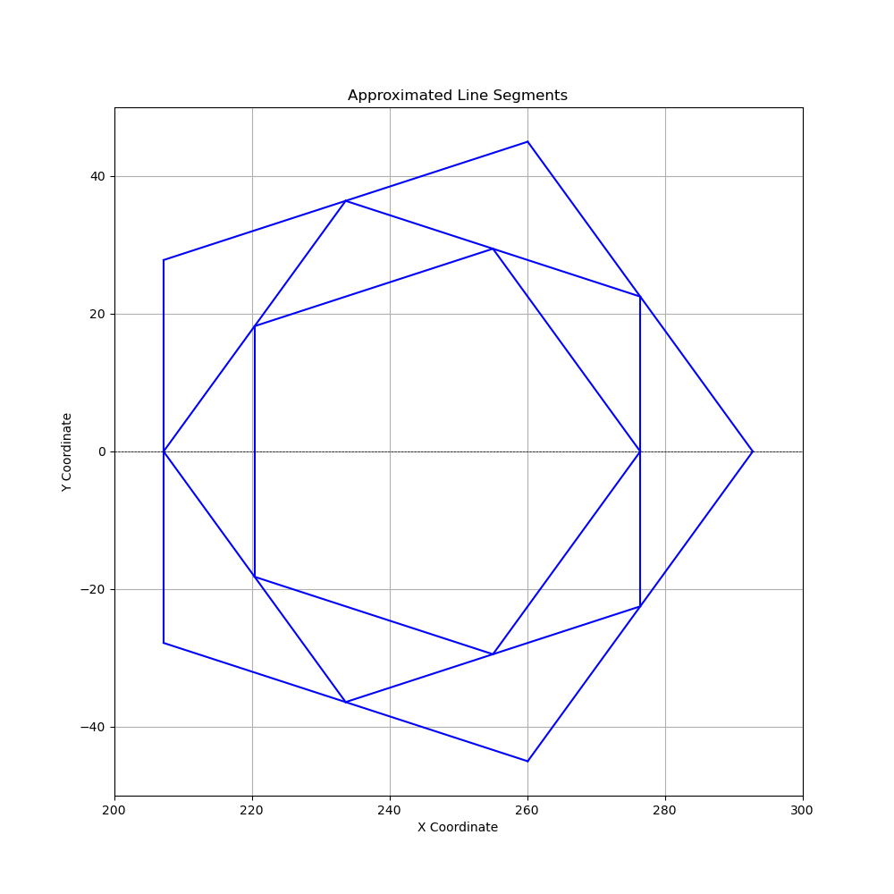

# Wlkata Python Extension

`wlkatapython-extensions` is a versatile Python library designed to simplify advanced robotic arm operations and integrate AI functionalities. This library offers modules for drawing with robotic arms based on user-provided images and includes AI modules for vision and voice applications. Whether you're a hobbyist, researcher, or developer, `wlkatapython-extensions` empowers you to create and innovate with ease.

## Features

### 1. Drawing Module
The Drawing Module enables users to:
- Easily convert an image into commands that a robotic arm can execute.
- Handle complex path planning for drawing with minimal setup.
- Support a wide range of robotic arms with customizable configurations.

### 2. AI Module (In future)
The AI Module includes:
- **Vision:**
  - Write digit with number it sees from camera with your own model
- **Voice:**
  - Use voice to control robotic arm 

## Usage

### Drawing Module
Here’s how you can use the Drawing Module to make your robotic arm draw an image or polygon:
```python
from drawing import Drawing

drawer = Drawing()
drawer.cali_z()

# Sample of drawing spiral
drawer.draw('sample/spiral.jpg')

# Sample of drawing polygon
drawer.draw_poly(num_side=5, depth=3)
```


