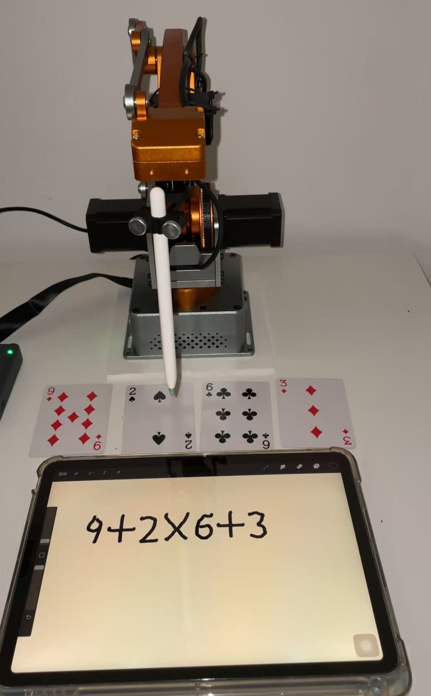

# Wlkata Python Extension - 🦾 Robotic Arm Drawing System
## 🎨 This project brings robotic artistry to life! 
> The system integrates computer vision, AI models, and robotic control to demonstrate practical automation and creative AI.

`wlkatapython-extensions` is a versatile Python library designed to simplify advanced robotic arm operations and integrate AI functionalities. This library offers modules for drawing with robotic arms based on user-provided images and includes AI modules for vision and voice applications. Whether you're a hobbyist, researcher, or developer, `wlkatapython-extensions` empowers you to create and innovate with ease.

## 🛠 Install
**Conda**
```bash
git clone https://github.com/wlkata/wlkatapython-extensions.git
cd wlkatapython-extensions
conda env create -f create_conda_env.yml
conda activate wlkata_extensions
python drawing/drawing.py # For example
```
**Other venv**
```bash
pip install -r requirements.txt
```

## ✨ Features

### 1. Drawing Module
The Drawing Module enables users to:
- Easily convert an image into commands that a robotic arm can execute.
- Handle complex path planning for drawing with minimal setup.
- Support a wide range of robotic arms with customizable configurations.
  
### 2. 24-Point Solver
- **Recognize poker cards with a camera**
- solve the classic "24-point game"
- **write the solution** on paper.

### 3. Selfie Drawing
- **Take a selfie**, convert it to **minimalist line art**
- have the **robotic arm draw your portrait**.

## Example 1: 🃏 Poker Card Recognition & 24-Point Solver

In this mode, the system detects 4 poker cards from a live video stream, calculates the 24-point solution, and writes it using the robotic arm.

### 🔧 Step-by-Step Instructions

1. **Train or Use YOLO Model**

   * You can either:

     * Train your own YOLOv5 model to detect poker cards
     * Or use the provided pre-trained weights (`.pt` file)

2. **Launch the Camera Stream and Detect Cards**

   * Run the detection script to start your webcam and recognize cards
   * This script will:

     * Detect playing cards using YOLO
     * Extract their ranks (e.g., 3, 7, A, K)
     * Send result to the 24-point solver when prompted to next step

3. **Solve the 24-Point Game**

   * The recognized cards are passed to the solver.
   * The solver computes an equation (e.g., `(3 + 7) * (A + K)`), where A=1, J=11, Q=12, K=13

4. **Command the Robotic Arm to Write**

   * The solution is converted to coordinates using the drawing module.
   * The robotic arm writes the answer on paper in front of it!

### 📸 Example Output

<p align="center">
  
  
</p>
<p align="center"><em>Figure 1: Results written by the robotic arm showing solutions to the 24-point game.</em></p>

<p align="center">
  
  
</p>
<p align="center"><em>Figure 2: Card recognition using YOLO detecting the input cards from a live video stream.</em></p>

---

## Example 2: 🤳 Selfie to Sketch Drawing

In this mode, you take a selfie, convert it into line art using AI, then draw it using the robot arm.

### 🔧 Step-by-Step Instructions

1. **Take or Choose a Selfie**

   * Capture a selfie using your webcam or choose an image you already have.

2. **Generate Sketch Using GPT (or DALL·E-style Tool)**

   * Use the following prompt in an image-to-image model (e.g., GPT with Vision or any image generator you have access to):

   ```
   Convert this photo into a clean, minimalist line art illustration. Use smooth, continuous lines to outline the people and main features. Exclude all colors, textures, and backgrounds—just simple black or dark brown contour lines on a white background. The style should resemble a sketch or cartoon, with facial expressions and poses clearly visible but very simple, very few lines, especially for hair, and try use only connected single line, and make them look prettier.
   ```

3. **Download and Save the Line Art Image**

   * Save the generated sketch as `selfie_sketch.png` or any preferred name.

4. **Post-process the Image**

   * The image is further processed to extract vectorized edge paths (e.g., Canny edge detection + vector tracing).

5. **Command the Robotic Arm to Draw**

   * The processed path is translated to coordinates and sent to the robotic arm

### 📸 Example Output

<p align="center">
  
  
</p>
<p align="center"><em>Figure 3: On the left is the original selfie; on the right is the GPT-generated minimalist line art used for robotic drawing.</em></p>

## 🛠 Requirements

* Python 3.8+
* OpenCV
* PyTorch + YOLOv5
* Numpy
* Robotic Arm SDK

> GPU recommended for YOLO inference.

## 💡 Tips

* Ensure proper lighting when using the webcam.
* Calibrate the robotic arm’s drawing area to fit standard A4 paper.

---

## 🤖 Hardware Compatibility

Tested with:

* MT4 or Mirobot
* USB webcam
* Pen holder & A4 paper mount (or iPad and Apple Pencil)

## ▶️ Basic Usage

### Drawing Module
Here’s how you can use the Drawing Module to make your robotic arm draw an image or polygon:
```python
from drawing import Drawing

drawer = Drawing()
drawer.cali_z()

# Sample of drawing spiral
drawer.draw('sample/spiral.jpg')

# Sample of drawing polygon
drawer.draw_poly(num_side=5, depth=3)
```

<p align="center">
  
  
</p>
<p align="center"><em>Figure 4: Example outputs from simple drawing tests — a spiral (left) and a polygon (right) drawn by the robotic arm.</em></p>
